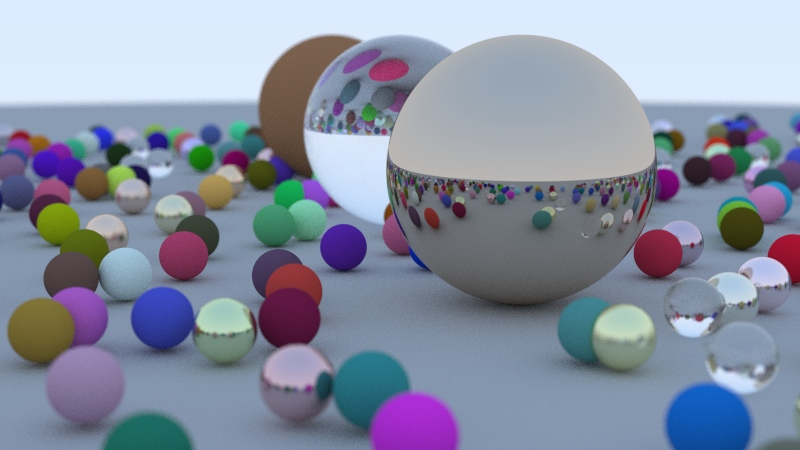
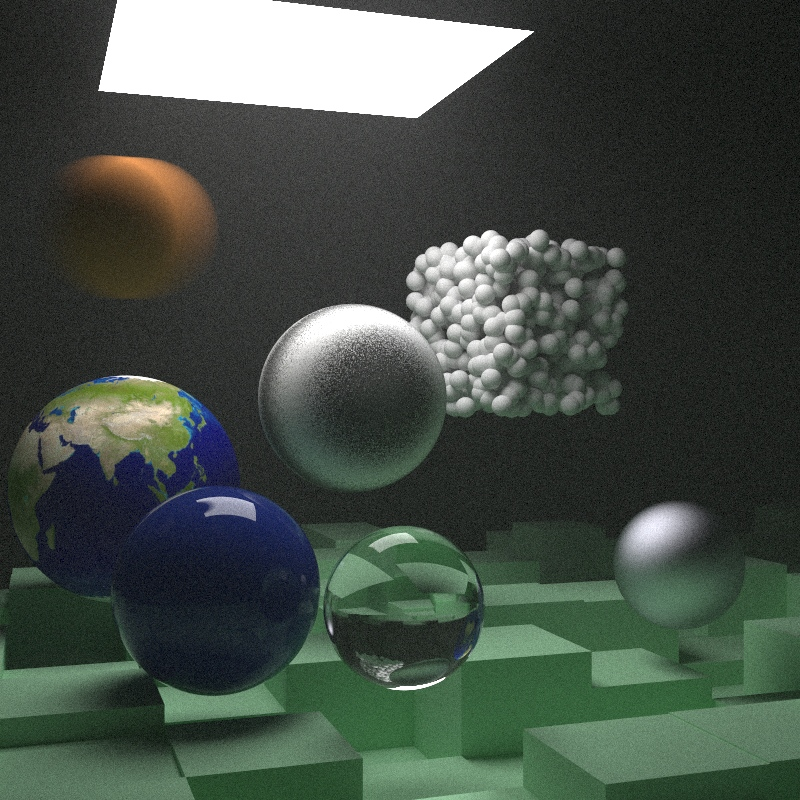

# [Ray Tracing](https://github.com/RayTracing/raytracing.github.io/tree/book1-review) series

Based on development branch.

Notes:

* Each change and resulting image has it's own separate folder
* Rendering is computed using several parallel threads (via `pmap`)
* Perlin is implemented but `fastmath.random` version is used (for a speed)
* `fastmath.vector` is used for vector operations
* Some minor enhancements are made
* The result is displayed in a window during rendering. `clojure2d.pixels` buffer is used as a storage.
* More optimized version starts with The Next Week, Chapter 10

Yes, it's slow!

;;

## Book1

## Book2

