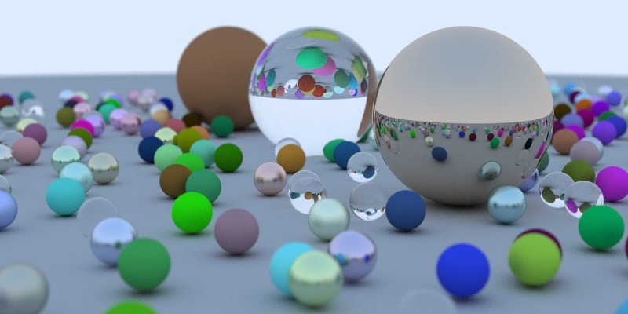

# Ray Tracing in One Weekend

Implementation in Clojure using Fastmath and Clojure2d libraries

## Final scene

## Book

[_Ray Tracing in One Weekend_](https://raytracing.github.io/books/RayTracingInOneWeekend.html)
